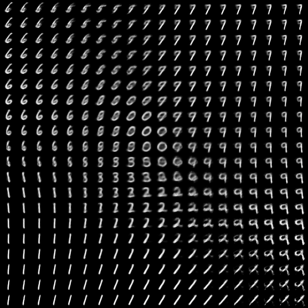
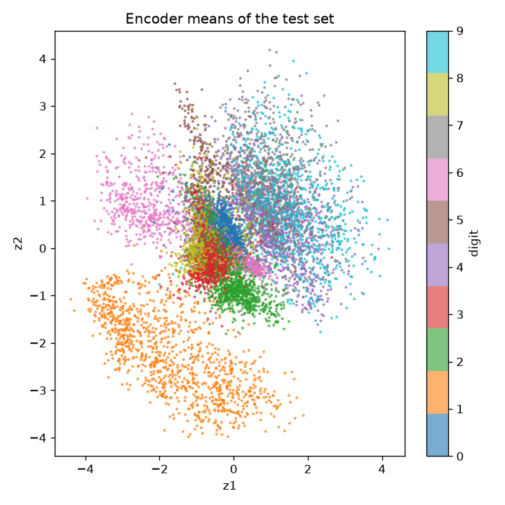
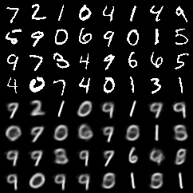
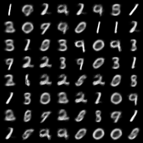

<!-- Shared decorative layout inspired by my original vision README and profile README. -->
<div align="center">

<h1>🌀 Variational Autoencoder From Scratch</h1>
<h3><code>One digit, one latent space, one evidence lower bound</code></h3>


<p>


</p>

[](https://linkedin.com/in/somil-singh)
[](mailto:somils@andrew.cmu.edu)
[](https://x.com/Skywalkerlyzv)
[](https://medium.com/@thesomilsinghofficial)
[](https://thesomilsingh.substack.com/)
[](https://youtube.com/@yourstrulyhq)

[Open this project](https://github.com/somilsin/Machine-Learning/tree/main/Deep-Learning_Computer-Vision/Variational-Autoencoder-From-Scratch) · [My GitHub](https://github.com/somilsin) · [My portfolio](https://somilsin.github.io/Artificial-Intelligence/portfolio/)

</div>

<br>

## 📖 About This Repository

---

This is the companion code for my YouTube lecture *Variational Autoencoders, Visually Explained* on [AI & Coffee with Somil](https://youtube.com/@yourstrulyhq). I build a VAE for binarized handwritten digits in one short file, train it, and keep the real outputs beside the code so the lecture's ideas can be checked against an actual run.

<br>

## 🚀 Key Implementations

---

* Gaussian encoder that outputs a mean and a log variance per latent dimension
* Reparameterization trick so gradients reach the encoder through the random sample
* Negative ELBO loss: Bernoulli reconstruction term plus the closed-form KL to N(0, I)
* Generation from the prior, a decoded 2D latent manifold and a latent scatter of the test set

<br>

## 🎓 Project Guide

---

### Overview

A plain autoencoder compresses an image and rebuilds it, but nothing tells us where new codes should come from. A VAE fixes that by making the code a distribution. The encoder predicts a small Gaussian cloud for each image, the decoder learns to rebuild the image from any sample of that cloud, and a KL penalty keeps every cloud close to a standard normal prior. After training I can sample from the prior and decode brand new digits.

### What is here

1. [vae.py](vae.py) holds the model, the loss, the training loop and the figure export in one file.
2. [requirements.txt](requirements.txt) lists the four packages the script needs.
3. [outputs](outputs) keeps the results of my run: loss history, reconstructions, prior samples, the latent manifold and the latent scatter.

### Code flow

| Step | Where in `vae.py` | Lecture chapter |
| :--- | :--- | :--- |
| Flatten a 28×28 digit to 784 values | `VAE.encode` | First, an autoencoder |
| Predict a mean and a log variance | `self.mu`, `self.logvar` | Encode a distribution, not a point |
| Sample z = μ + σ·ε | `VAE.reparameterize` | The reparameterization trick |
| Decode z to 784 logits | `VAE.decode` | What the decoder predicts |
| Reconstruction (BCE) + KL, summed per image, averaged over the batch | `loss_terms` | The ELBO, two terms · KL in closed form |
| One latent sample per image, one Adam step on encoder and decoder together | `main` training loop | The training loop · Why not alternate? |
| Draw z from N(0, I) and decode | `save_figures` | Generate something new |

<br>

## 🛠️ Tech Stack

---

<p align="center">

</p>

`Python` · `PyTorch` · `torchvision` · `Matplotlib`

<br>

## ⚙️ Getting Started

---

### How I run it

```bash
git clone https://github.com/somilsin/Machine-Learning.git
cd Machine-Learning/Deep-Learning_Computer-Vision/Variational-Autoencoder-From-Scratch
python -m pip install -r requirements.txt
python vae.py --epochs 10 --latent-dim 2 --out outputs
```

The script downloads MNIST into a local `data` folder and binarizes every pixel at 0.5, so the Bernoulli likelihood is a literal model choice. It uses CUDA when available and runs fine on a CPU. Two latent dimensions keep the latent space drawable; pass a larger `--latent-dim` for sharper samples.

<br>

## 📝 My Notes and Results

---

### My notes on the implementation

I sum the pixel losses and the latent KL terms per image and only then average over the batch, so every number is in nats per image. I compute binary cross-entropy directly from logits for numerical stability, and I apply the sigmoid only when I display probabilities. The prior mean images show the decoder's probabilities, which is why they look soft; the pixel samples draw actual Bernoulli pixels from those probabilities.

### Execution record

On 8 October 2026 I trained the model for 10 epochs with a 2D latent space on my laptop CPU. Training took 2 minutes 16 seconds.

| Epoch | Train loss | Test loss | Test reconstruction | Test KL |
| :---: | :---: | :---: | :---: | :---: |
| 1 | 188.63 | 167.94 | 162.41 | 5.53 |
| 5 | 156.70 | 156.50 | 150.91 | 5.59 |
| 10 | 151.58 | **152.60** | 146.70 | 5.90 |

All values are nats per image; the full history is in [outputs/history.csv](outputs/history.csv).

| Decoded latent manifold (z in [-3, 3]²) | Encoder means of the test set |
| :---: | :---: |
|  |  |

| Inputs (top) and reconstructions (bottom) | Samples from the prior (mean images) |
| :---: | :---: |
|  |  |

<br>

## 📚 References and Credit

---

### Papers and references

* Kingma and Welling (2013), [Auto-Encoding Variational Bayes](https://arxiv.org/abs/1312.6114)
* Kingma and Welling (2019), [An Introduction to Variational Autoencoders](https://arxiv.org/abs/1906.02691)
* The official [PyTorch VAE example](https://github.com/pytorch/examples/blob/main/vae/main.py), which I used to cross-check the loss conventions
* CMU 10-423/623 Generative AI, Lecture 9 by Matt Gormley, [VAEs + PGMs](https://www.mlcourse.org/10423/), which I used as a study reference for the graphical model view and the derivation

The code, notes and lecture visuals are my own.

<br>

<div align="center">

### Get In Touch

I share my learning and projects here. Connect with me on [LinkedIn](https://linkedin.com/in/somil-singh) or explore [my portfolio](https://somilsin.github.io/Artificial-Intelligence/portfolio/).

[](https://linkedin.com/in/somil-singh)
[](mailto:somils@andrew.cmu.edu)
[](https://x.com/Skywalkerlyzv)
[](https://medium.com/@thesomilsinghofficial)
[](https://thesomilsingh.substack.com/)

*Thanks for stopping by!*

</div>
